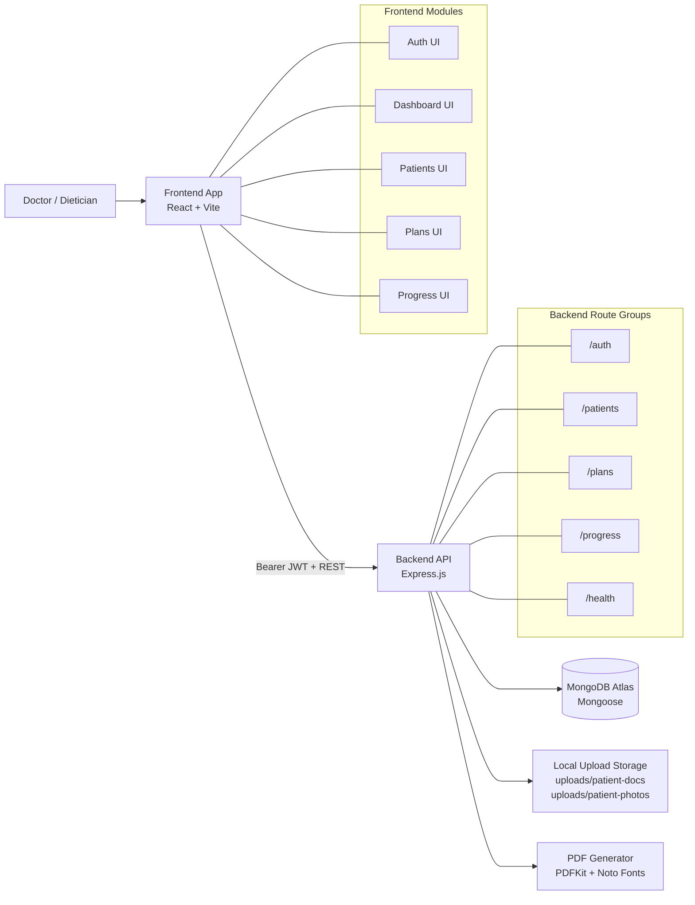
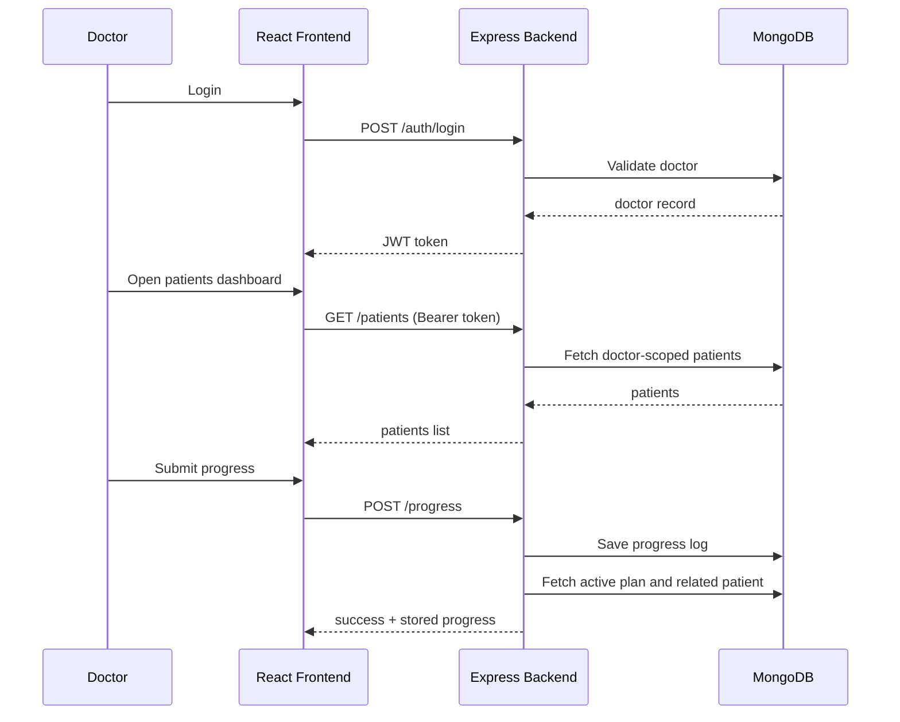

# AYUDIET Fullstack

AYUDIET is a doctor-first clinical diet management platform built as a fullstack web application.
This documentation is intentionally limited to modules and capabilities implemented in this repository.

## Table of Contents

- [1. Product Overview](#1-product-overview)
- [2. Key Capabilities Implemented](#2-key-capabilities-implemented)
- [3. High-Level Architecture](#3-high-level-architecture)
- [4. End-to-End User Workflow](#4-end-to-end-user-workflow)
- [5. Monorepo Structure](#5-monorepo-structure)
- [6. Backend Deep Dive (`ayudiet-v2`)](#6-backend-deep-dive-ayudiet-v2)
- [7. Frontend Deep Dive (`ayudiet-frontend`)](#7-frontend-deep-dive-ayudiet-frontend)
- [8. API Contract Overview](#8-api-contract-overview)
- [9. Data Model Overview](#9-data-model-overview)
- [10. Configuration Reference](#10-configuration-reference)
- [11. Local Development Setup](#11-local-development-setup)
- [12. Build and Run Commands](#12-build-and-run-commands)
- [13. Deployment Notes](#13-deployment-notes)
- [14. Security and Compliance Notes](#14-security-and-compliance-notes)
- [15. Troubleshooting Guide](#15-troubleshooting-guide)
- [16. Current Scope and Limitations](#16-current-scope-and-limitations)

## 1. Product Overview

AYUDIET helps doctors and dieticians:

- onboard and manage patients,
- create and review diet plans,
- track outcomes through progress logs,
- adjust plans based on patient response,
- export structured diet plans as PDF.

The platform is organized as:

- a React + Vite frontend (`ayudiet-frontend`),
- a Node.js + Express backend (`ayudiet-v2`),
- MongoDB persistence via Mongoose.

## 2. Key Capabilities Implemented

### 2.1 Doctor Authentication and Session

- Email/password signup and login
- JWT-based API authorization
- Optional Google login path
- Optional Clerk token exchange path
- Optional email OTP verification flow

### 2.2 Patient Lifecycle

- Create, read, update, delete patients
- Doctor ownership checks on patient resources
- Patient profile fields for health and planning inputs
- Patient photo upload and delete
- Patient PDF document upload, download, and delete

### 2.3 Diet Plan Lifecycle

- Create and update plans
- Plan status workflow: `pending`, `approved`, `rejected`
- Active plan tracking
- Plan adjustment endpoint
- AI-generation related plan endpoints exposed in backend

### 2.4 Progress and Adaptive Tracking

- Progress log creation per patient
- Progress retrieval history for patient
- Trend fields: weight, energy, digestion, adherence, sleep, water, stress, etc.
- Plan modification service integration on progress submission

### 2.5 Dashboard and Reporting

- Dashboard stats endpoint for doctor workspace
- Downloadable diet plan PDF generation
- Structured day/slot meal rendering in PDF

### 2.6 Frontend UX Surface

- Public screens: home, login, signup
- Protected dashboard shell
- Patient listing and details pages
- Add/edit patient pages
- Meal library screen
- Chatbot screen
- Download plan page

## 3. High-Level Architecture

### 3.1 System Block Diagram



### 3.2 Request Path Diagram



## 4. End-to-End User Workflow

1. Doctor signs up or logs in.
2. Frontend stores JWT (`localStorage`) and uses it in API calls.
3. Doctor adds a patient with demographics and planning context.
4. Doctor creates/generates a diet plan and sets review state.
5. Doctor approves plan for activation.
6. Doctor logs follow-up progress for patient.
7. Backend computes/supports adjustment logic and records history.
8. Doctor downloads PDF plan for patient sharing.

## 5. Monorepo Structure

```text
AYUDIET-FULLSTACK/
  ayudiet-frontend/          # React + Vite application
  ayudiet-v2/                # Express + MongoDB backend
  DEPLOY_RENDER.md           # deployment reference
  README.md                  # this documentation
```

## 6. Backend Deep Dive (`ayudiet-v2`)

### 6.1 Stack and Runtime

- Node.js (engine: `>=20 <23`)
- Express
- Mongoose
- JWT
- Multer
- PDFKit
- Jest

### 6.2 Backend Runtime Flow

- `src/server.js`
  - loads env
  - validates runtime environment
  - connects MongoDB
  - starts Express app
- `src/app.js`
  - configures CORS and middleware
  - mounts route groups
  - mounts `/uploads` static directory
  - 404 handler + centralized error handler

### 6.3 Backend Route Groups

- `src/routes/auth.routes.js`
- `src/routes/patient.routes.js`
- `src/routes/plan.routes.js`
- `src/routes/progress.routes.js`
- `src/routes/health.routes.js`

Routes are mounted under both prefixes:

- direct routes: `/auth`, `/patients`, `/plans`, `/progress`, `/health`
- prefixed routes: `/api/auth`, `/api/patients`, `/api/plans`, `/api/progress`, `/api/health`

### 6.4 Auth and Access Control

- `auth.middleware.js` validates `Authorization: Bearer <token>`
- Invalid/missing/expired token -> `401`
- Ownership checks enforce doctor-level resource isolation in patient/progress/plan access

### 6.5 File Upload Pipeline

- Upload middleware creates directories if missing:
  - `uploads/patient-docs`
  - `uploads/patient-photos`
- Validation:
  - patient documents: PDF only, max 5MB
  - patient photos: JPG/PNG/WEBP, max 3MB
- Rate limiting:
  - upload window: 10 minutes
  - max uploads: 20 per doctor per window
- Additional PDF signature validation in patient controller (`%PDF-` check)

### 6.6 PDF Generation

PDF endpoint builds a structured day/slot plan sheet:

- A4 layout with clinic header and patient metadata
- day-wise table with slot labels
- fonts and language-safe text rendering logic
- downloadable binary response with generated filename

### 6.7 Backend Error Handling

- Centralized error middleware returns JSON shape:
  - `success: false`
  - `message: <error message>`
- Non-operational errors are masked in production mode

## 7. Frontend Deep Dive (`ayudiet-frontend`)

### 7.1 Stack

- React 19
- Vite 7
- Tailwind CSS 4
- Axios
- Zustand
- React Router

### 7.2 App Boot Process

- `src/main.jsx` mounts `AppBootstrap`
- `AppBootstrap` wraps app in `BrowserRouter`
- `AppRoutes` defines all public and protected routes

### 7.3 Protected Routing

- `ProtectedRoute` checks token in `localStorage`
- Missing token redirects to `/login`

### 7.4 API Layer

- Axios instance in `src/utils/api.js`
  - injects bearer token via interceptor
- `fetchJson` helper in `src/services/api.js`
  - handles `/api` fallback retry when direct route 404 occurs
  - persists route-prefix preference
  - normalizes request/response handling

### 7.5 Frontend Route Map

Public routes:

- `/`
- `/login`
- `/signup`

Protected routes under `/dashboard`:

- `/dashboard`
- `/dashboard/patients`
- `/dashboard/patients-table`
- `/dashboard/meals-cart`
- `/dashboard/chatbot`
- `/dashboard/download-plan`
- `/dashboard/add-patient`
- `/dashboard/patients/:id`
- `/dashboard/patients/:id/meal-library`
- `/dashboard/patients/:id/edit`

### 7.6 State Management

Zustand plan store (`plansStore.js`) currently handles:

- per-patient plan cache map,
- set full patient plans,
- upsert plan in cached list.

## 8. API Contract Overview

### 8.1 Auth Endpoints

- `POST /auth/signup`
- `POST /auth/verify-email`
- `POST /auth/login`
- `POST /auth/google`
- `POST /auth/clerk/exchange`
- `GET /auth/me`

### 8.2 Patient Endpoints

- `POST /patients`
- `GET /patients`
- `GET /patients/:id`
- `PUT /patients/:id`
- `DELETE /patients/:id`
- `POST /patients/:id/photo`
- `DELETE /patients/:id/photo`
- `POST /patients/:id/documents`
- `GET /patients/:id/documents/:documentId/download`
- `DELETE /patients/:id/documents/:documentId`

### 8.3 Plan Endpoints

- `GET /plans/pending`
- `GET /plans/active`
- `GET /plans/patient/:patientId`
- `POST /plans`
- `PUT /plans/:id`
- `PATCH /plans/:id/approve`
- `PATCH /plans/:id/reject`
- `PATCH /plans/:id/apply-adjustments`
- `POST /plans/generate-ai`
- `POST /plans/generate-day`
- `POST /plans/generate-slot-chart`
- `POST /plans/fix-ai`
- `POST /plans/download-pdf`

### 8.4 Progress Endpoints

- `POST /progress`
- `GET /progress/:patientId`

### 8.5 Health Endpoints

- `GET /health`
- `GET /health/dashboard-stats`

## 9. Data Model Overview

### 9.1 Doctor

Primary fields:

- `name`, `email`, `password`
- `clinicMobile`
- `emailVerified`
- OTP hash/expiry fields for verification flow
- timestamps

### 9.2 Patient

Primary groups:

- core identity: name, age, gender, contact
- clinical context: conditions, medications, allergies
- ayurvedic input: dominant dosha (`prakriti.dominantDosha`)
- planning inputs: goal, target weight, timeframe, meal timings, region, budget
- media: `photo`, `documents[]`
- history collections: `planHistory`, `preferenceHistory`, `adherenceHistory`
- doctor reference + timestamps

### 9.3 Plan

Primary groups:

- references: doctor, patient
- descriptors: title, goal, dosha type
- meals array with slots:
  - earlyMorning, morning, afterExercise, breakfast, midMorning,
  - lunch, after2Hours, evening, lateEvening, dinner, bedTime
- lifecycle fields:
  - `status`, `isActive`, `reviewDueDate`, `adjustments`, `adjustmentsApplied`
- timestamps + indexing

### 9.4 ProgressLog

Primary groups:

- references: patient, plan, doctor
- metrics:
  - weight, energyLevel, symptomScore
  - digestion + digestionDetail
  - adherence
  - sleepHours, waterIntakeLiters, appetite
  - activityMinutes, stressLevel
- notes + recordedAt + timestamps

## 10. Configuration Reference

### 10.1 Backend Environment Variables

Required:

- `MONGO_URI`
- `JWT_SECRET`

Core:

- `NODE_ENV`
- `PORT`
- `CORS_ORIGIN`
- `FRONTEND_ORIGIN`
- `ALLOW_LOCALHOST_ORIGINS`
- `LOCAL_ORIGIN_PORTS`

Optional auth integrations:

- `ENABLE_GOOGLE_AUTH`
- `GOOGLE_CLIENT_ID`
- `ENABLE_CLERK_AUTH`
- `CLERK_SECRET_KEY`
- `CLERK_AUDIENCE`
- `CLERK_AUTHORIZED_PARTIES`

Optional email verification:

- `ENABLE_EMAIL_OTP_VERIFICATION`
- `RESEND_API_KEY`
- `RESEND_FROM_EMAIL`

Additional backend optional keys (if used in your environment):

- AI/provider-related keys present in backend env templates can remain unset if not used.

### 10.2 Frontend Environment Variables

- `VITE_API_URL`
- `VITE_LOCAL_API_URL`
- `VITE_ENABLE_GOOGLE_AUTH`
- `VITE_GOOGLE_CLIENT_ID`
- `VITE_ENABLE_CLERK_AUTH`
- `VITE_CLERK_PUBLISHABLE_KEY`

## 11. Local Development Setup

### 11.1 Clone and Install

```bash
git clone <your-repo-url>
cd AYUDIET-FULLSTACK
```

Backend:

```bash
cd ayudiet-v2
npm install
```

Frontend:

```bash
cd ../ayudiet-frontend
npm install
```

### 11.2 Create Backend `.env`

Path: `ayudiet-v2/.env`

```env
NODE_ENV=development
PORT=5000
MONGO_URI=mongodb+srv://<user>:<password>@<cluster>.mongodb.net/<db>?retryWrites=true&w=majority
JWT_SECRET=<minimum_32_char_secret>

CORS_ORIGIN=http://localhost:5173
FRONTEND_ORIGIN=http://localhost:5173
ALLOW_LOCALHOST_ORIGINS=true
LOCAL_ORIGIN_PORTS=5173,5174

ENABLE_GOOGLE_AUTH=false
GOOGLE_CLIENT_ID=
ENABLE_CLERK_AUTH=false
CLERK_SECRET_KEY=
CLERK_AUDIENCE=
CLERK_AUTHORIZED_PARTIES=

ENABLE_EMAIL_OTP_VERIFICATION=false
RESEND_API_KEY=
RESEND_FROM_EMAIL=
```

### 11.3 Create Frontend `.env`

Path: `ayudiet-frontend/.env`

```env
VITE_API_URL=http://localhost:5000
VITE_LOCAL_API_URL=
VITE_ENABLE_GOOGLE_AUTH=false
VITE_GOOGLE_CLIENT_ID=
VITE_ENABLE_CLERK_AUTH=false
VITE_CLERK_PUBLISHABLE_KEY=
```

### 11.4 Start Services

Backend terminal:

```bash
cd ayudiet-v2
npm start
```

Frontend terminal:

```bash
cd ayudiet-frontend
npm run dev
```

Frontend usually runs on `http://localhost:5173`
Backend usually runs on `http://localhost:5000`

## 12. Build and Run Commands

### 12.1 Backend Commands

```bash
# start backend
npm start

# run backend tests
npm test

# seed mock data
npm run seed
```

### 12.2 Frontend Commands

```bash
# dev server
npm run dev

# production build
npm run build

# lint
npm run lint

# render/start script
npm start
```

`npm start` in frontend uses `scripts/render-start.mjs` and runs `vite preview` on `PORT` (default `4173`).

## 13. Deployment Notes

- See [DEPLOY_RENDER.md](/c:/Users/Atharv/AYUDIET-FULLSTACK/DEPLOY_RENDER.md) for Render setup.
- Recommended approach:
  - backend as Web Service,
  - frontend as Static Site (or Web Service alternative).
- In production:
  - set frontend `VITE_API_URL` to deployed backend URL,
  - set backend CORS origins to deployed frontend URL,
  - keep secrets in platform env manager.

## 14. Security and Compliance Notes

- Never commit `.env` files or secrets.
- Use a strong `JWT_SECRET` (32+ chars).
- Keep API over HTTPS in production.
- Patient documents/photos are sensitive: apply strict access controls and retention policies.
- Uploads are filesystem-based in current implementation; use persistent and secure storage in production.

## 15. Troubleshooting Guide

### 15.1 Backend does not start

Check:

- `MONGO_URI` format (`mongodb+srv://...mongodb.net/...` expected)
- `JWT_SECRET` is present
- Atlas IP/network access and credentials

### 15.2 Frontend cannot reach backend

Check:

- backend running on expected port
- `VITE_API_URL` value
- CORS values (`CORS_ORIGIN`, `FRONTEND_ORIGIN`)
- browser console/network for 401/403/404 errors

### 15.3 401 Unauthorized on protected routes

Check:

- token exists in localStorage
- token not expired/invalid
- request includes `Authorization: Bearer <token>`

### 15.4 Document upload errors

Check:

- file is valid PDF
- file size <= 5MB
- upload limit not exceeded (20 per 10 minutes per doctor)

### 15.5 Photo upload errors

Check:

- file extension/mime is JPG/PNG/WEBP
- file size <= 3MB

## 16. Current Scope and Limitations

- This README covers only implemented modules in this repository.
- Upload storage is local-disk based (not object storage by default).
- Route compatibility includes both root and `/api` prefixes for client flexibility.
- Environment templates include optional provider keys; keep disabled/unset if not part of your active deployment.
