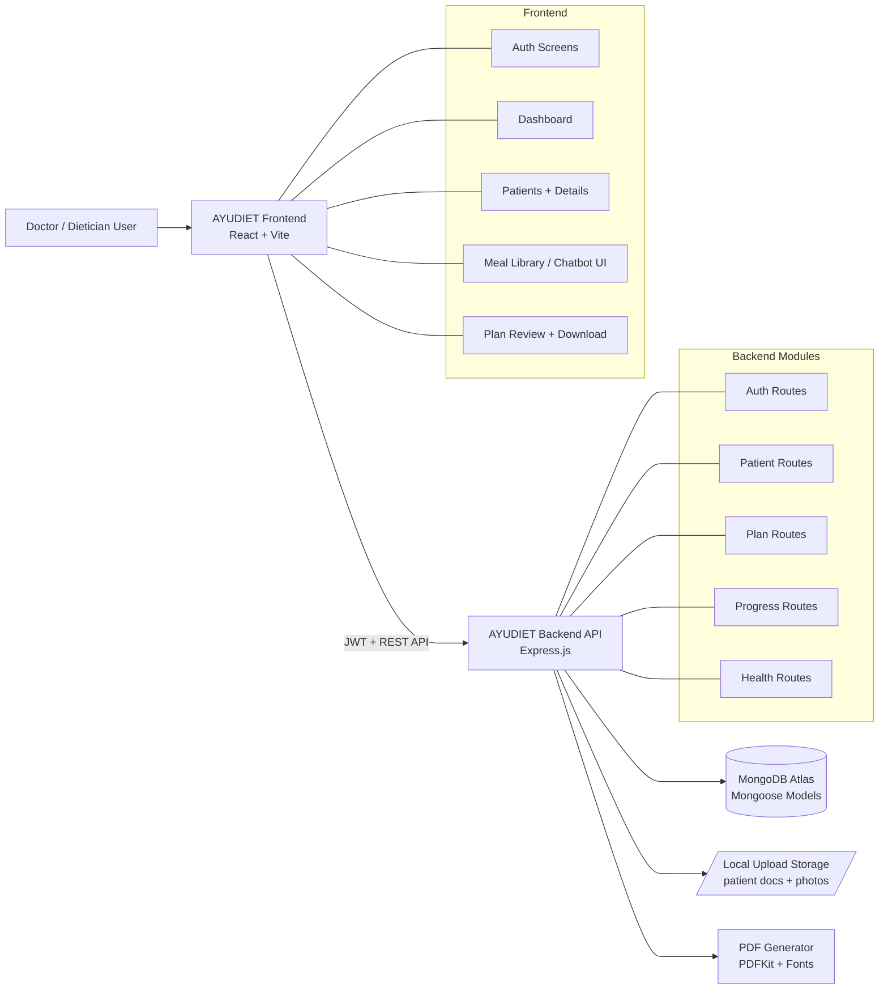

# AYUDIET Fullstack

AYUDIET is a fullstack clinical diet management platform for doctors and dieticians.
This README documents only the implemented and actively used modules in this repo.

## What Is Built

- Doctor authentication with JWT session handling
- Optional Google and Clerk login switches
- Patient management (create, read, update, delete)
- Patient photo and document upload/download
- Diet plan creation and plan lifecycle management
- Plan review workflow (`pending`, `approved`, `rejected`) with active plan state
- Progress logging (weight, energy, digestion, adherence, and more)
- Adaptive plan adjustment support based on progress
- Dashboard statistics endpoint for doctor workspace
- Diet plan PDF generation/download flow
- Frontend dashboard, patient pages, meal library, and chatbot page

## Project Structure

```text
AYUDIET-FULLSTACK/
  ayudiet-frontend/   # React + Vite frontend
  ayudiet-v2/         # Node.js + Express + MongoDB backend
  DEPLOY_RENDER.md    # deployment reference
```

## Block Diagram (System Architecture)



## End-to-End Flow

1. Doctor signs up or logs in and receives JWT.
2. Frontend stores token and calls protected backend routes.
3. Doctor creates patients and uploads reports/photos if needed.
4. Doctor creates or generates a plan and reviews plan status.
5. Approved plan becomes active for patient tracking.
6. Doctor records progress logs over time.
7. Backend processes progress and supports plan adjustments.
8. Plan can be exported as PDF and shared.

## Tech Stack

- Frontend: React 19, Vite, Tailwind CSS, Axios, Zustand, React Router
- Backend: Node.js, Express, MongoDB, Mongoose, JWT, Multer, PDFKit
- Auth Integrations (optional): Google token verification, Clerk exchange

## Prerequisites

- Node.js `>=20 <23`
- npm
- MongoDB connection URI

## Local Setup

### 1) Backend (`ayudiet-v2`)

```bash
cd ayudiet-v2
npm install
```

Create `ayudiet-v2/.env`:

```env
NODE_ENV=development
PORT=5000
MONGO_URI=mongodb+srv://<user>:<pass>@<cluster>.mongodb.net/<db>?retryWrites=true&w=majority
JWT_SECRET=<min_32_char_secret>

# CORS
CORS_ORIGIN=http://localhost:5173
FRONTEND_ORIGIN=http://localhost:5173
ALLOW_LOCALHOST_ORIGINS=true
LOCAL_ORIGIN_PORTS=5173,5174

# Optional auth
ENABLE_GOOGLE_AUTH=false
GOOGLE_CLIENT_ID=
ENABLE_CLERK_AUTH=false
CLERK_SECRET_KEY=
CLERK_AUDIENCE=
CLERK_AUTHORIZED_PARTIES=

# Optional email verification
ENABLE_EMAIL_OTP_VERIFICATION=false
RESEND_API_KEY=
RESEND_FROM_EMAIL=
```

Run backend:

```bash
npm start
```

Run backend tests:

```bash
npm test
```

Optional mock seeding:

```bash
npm run seed
```

### 2) Frontend (`ayudiet-frontend`)

```bash
cd ayudiet-frontend
npm install
```

Create `ayudiet-frontend/.env`:

```env
VITE_API_URL=http://localhost:5000
VITE_LOCAL_API_URL=
VITE_ENABLE_GOOGLE_AUTH=false
VITE_GOOGLE_CLIENT_ID=
VITE_ENABLE_CLERK_AUTH=false
VITE_CLERK_PUBLISHABLE_KEY=
```

Run frontend:

```bash
npm run dev
```

Build frontend:

```bash
npm run build
```

## API Base Paths

Backend registers both route styles:

- `/auth`, `/patients`, `/plans`, `/progress`, `/health`
- `/api/auth`, `/api/patients`, `/api/plans`, `/api/progress`, `/api/health`

This supports both direct API calls and proxy-style local setup.

## API Overview

### Auth

- `POST /auth/signup`
- `POST /auth/verify-email`
- `POST /auth/login`
- `POST /auth/google`
- `POST /auth/clerk/exchange`
- `GET /auth/me`

### Patients

- `POST /patients`
- `GET /patients`
- `GET /patients/:id`
- `PUT /patients/:id`
- `DELETE /patients/:id`
- `POST /patients/:id/photo`
- `DELETE /patients/:id/photo`
- `POST /patients/:id/documents`
- `GET /patients/:id/documents/:documentId/download`
- `DELETE /patients/:id/documents/:documentId`

### Plans

- `GET /plans/pending`
- `GET /plans/active`
- `GET /plans/patient/:patientId`
- `POST /plans`
- `PUT /plans/:id`
- `PATCH /plans/:id/approve`
- `PATCH /plans/:id/reject`
- `PATCH /plans/:id/apply-adjustments`
- `POST /plans/generate-ai`
- `POST /plans/generate-day`
- `POST /plans/generate-slot-chart`
- `POST /plans/fix-ai`
- `POST /plans/download-pdf`

### Progress

- `POST /progress`
- `GET /progress/:patientId`

### Health

- `GET /health`
- `GET /health/dashboard-stats`

## Key Data Models

- `Doctor`: profile + auth fields + optional email verification fields
- `Patient`: demographics, planning inputs, documents, photo, history arrays
- `Plan`: dosha-aware day/slot meals, review status, active state, adjustments
- `ProgressLog`: adherence and health trend records linked to patient/plan

## Frontend Pages (Current)

- Public: `Home`, `Login`, `Signup`
- Protected dashboard:
  - `Dashboard`
  - `Patients`
  - `Patients Table`
  - `Add Patient`
  - `Patient Details`
  - `Edit Patient`
  - `Meal Library`
  - `Chatbot`
  - `Download Plan`

## Deployment

Use [`DEPLOY_RENDER.md`](/c:/Users/Atharv/AYUDIET-FULLSTACK/DEPLOY_RENDER.md) for Render configuration (frontend + backend).

## Security Notes

- Never commit `.env` files.
- Keep `JWT_SECRET` strong (minimum 32 chars).
- Use HTTPS frontend URL in production.
- Uploaded patient files are stored locally under backend `uploads/`; use persistent storage in production.

## License

Add your preferred license before public release.
